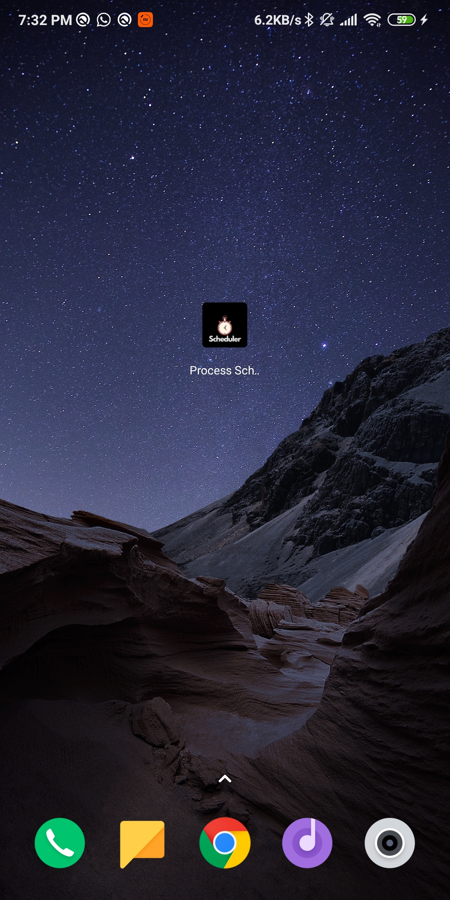

# Process Scheduler

Process Scheduler is a flutter mobile application compatible with both IOS, Android, Windows, and Mac That aims to ***draw*** the processes inputs from the user based on the principles of Operating Systems Scheduling and calculating the average time.

## Screens from Desktop

1.The .exe file

2.Desktop Menu

3.Adding a Process

4.Choosing a Schedulers Type

5.Gantt Chart Drawn with the average time calculated

## Screens from Phone

1.Phone's Icon

2.Phone Menu
Phone Menu
Phone Menu

3.Adding a Process

4.Choosing a Schedulers Type

5.Gantt Chart Drawn with the average time calculated
